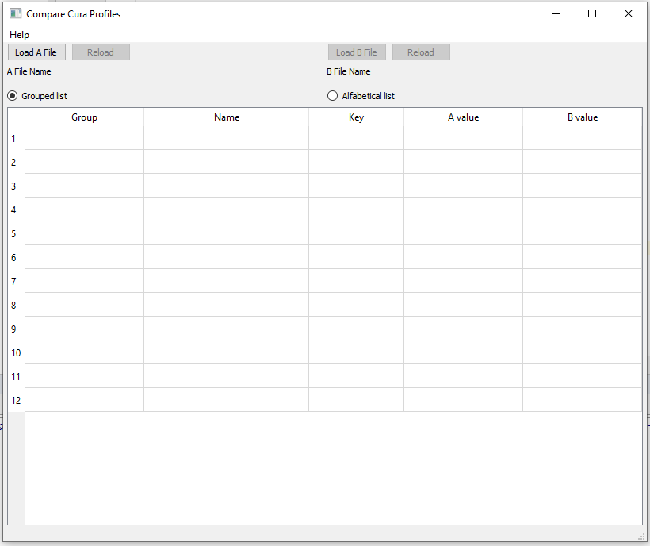
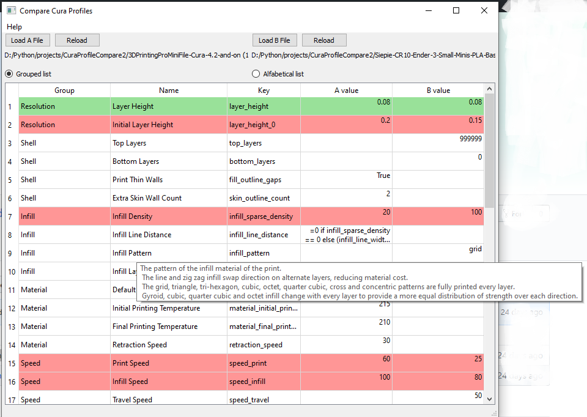

CuraProfileCompare 0.2.0 - to visualy compare two Ultimaker Cura profiles 
======================================================================================
// code by aleksandarpu@gmail.com

CuraProfileCompare is Qt5 python application that allow visual compararison of the two
*.curaprofile files.

News:
- merge all curaprofile info into one list (ignore metadata and general segments)
- load https://github.com/tjjfvi/CuraSettingsInjector from gcode file
- load cura SETTINGS_3 part from gcode file
- sort keys alfabeticaly or grouped (groups are from Cura 4.4 fdmprinter.def.json file)
- tootlips for keys are from Cura 4.4 fdmprinter.def.json file
- mark same values with green background
- mark differences with (let's say) red background

Available binaries
-------------------
CuraProfileCompare require python3.6+ and Qt5

Link to binaries:
https://drive.google.com/drive/folders/1dm8TKSFOK9Hd8YJmKcHlVnJIYc7gJ6-7?usp=sharing

CuraProfileCompare-onefile.tgz - generated with pyinstaller but with option --onefile
CuraProfileCompare.tar.gz contains bundle made with pyinstaller for Linux
CuraProfileCompare-onefile.zip is also generated with pyinstaller but with option --onefile
CuraProfileCompare.zip contains bundle made with pyinstaller for Windows

Last versions:
CuraCompareProfiles-v0.1.0.zip 
CuraCompareProfiles-onefile-v0.1.0.zip 

Dependances
-------------------
PyQt5
configparser

Running the utility
-------------------
This is a simple GUI application to load and compare 2 files
First, click 'Load A file' and content will be displayed in tables.
This will enable 'Load B file' button.
When second files are loaded, in the table you will see 'A value' and 'B value' columns.
A is from first file and B is from second one.

The *.curaprofile files are zip archive files with 2 files added in.
Each file has config file (*.ini0 structure with 3 sections:
[general], [metadata] and [values]
This is displayed in 'Section' column in tables
Because of two files with similar content I can't assume right pairing for comparison 
and thus I added 'Swap sections' button to swap B files from upper table to lower and vice verse.

I hope this app will help to someone dealing with Cura profiles

Any suggestion is welcome.
If you have idea for better way to display profiles let me know

Version History
----------------
0.0.1  - Basic functionality

0.0.2  - Data in tables are sorted now. Added app version in About box

0.1.0  -  Better layout, tooltips for labels and data
          Reload button for B file added
