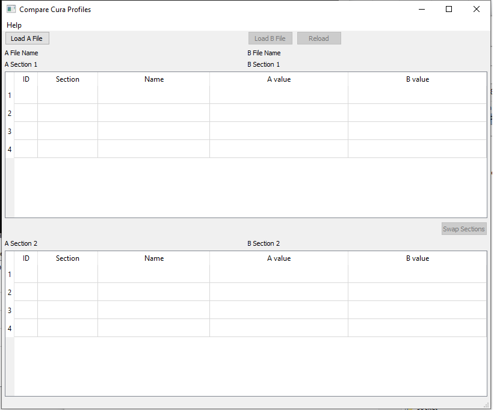
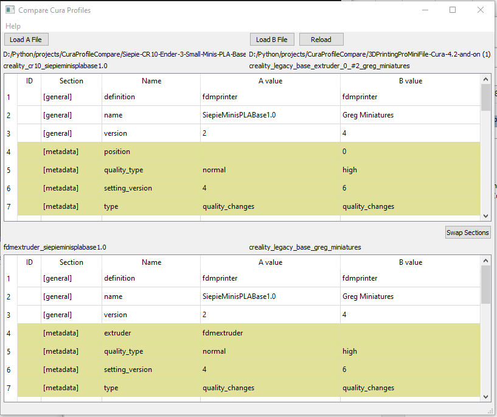

CuraProfileCompare 0.0.2 - to visualy compare two Ultimaker Cura profiles 
======================================================================================
// code by aleksandarpu@gmail.com

CuraProfileCompare is Qt5 python application that allow visual compararison of the two
*.curaprofile files.

Available binaries
-------------------
CuraProfileCompare require python3.6+ and Qt5
CuraProfileCompare-onefile.tgz - generated with pyinstaller but with option --onefile
https://drive.google.com/open?id=19gNOpRlo7Pc51B0uUIe_HhN31HfnOyXF

CuraProfileCompare.tar.gz contains bundle made with pyinstaller for Linux
https://drive.google.com/open?id=18eD-v_z-06bq6H0ZI0nBjpiZ5L9pfFPa

CuraProfileCompare-onefile.zip is also generated with pyinstaller but with option --onefile
https://drive.google.com/open?id=1UZttQDb9LIuR_AUCr0KoaW4ZBfyc8FVK

CuraProfileCompare.zip contains bundle made with pyinstaller for Windows
https://drive.google.com/open?id=1LVf4kb-ob54d_olcoOzwpTIXRufqNN57

Dependances
-------------------
PyQt5
configparser

Running the utility
-------------------
This is a simple GUI application to load and compare 2 files
First, click 'Load A file' and content will be displayed in tables.
This will enable 'Load B file' button.
When second files are loaded, in the table you will see 'A value' and 'B value' columns.
A is from first file and B is from second one.

The *.curaprofile files are zip archive files with 2 files added in.
Each file has config file (*.ini0 structure with 3 sections:
[general], [metadata] and [values]
This is displayed in 'Section' column in tables
Because of two files with similar content I can't assume right pairing for comparison 
and thus I added 'Swap sections' button to swap B files from upper table to lower and vice verse.

I hope this app will help to someone dealing with Cura profiles

Any suggestion is welcome.
If you have idea for better way to display profiles let me know

Version History
----------------
0.0.1  - Basic functionality

0.0.2  - Data in tables are sorted now. Added app version in About box
